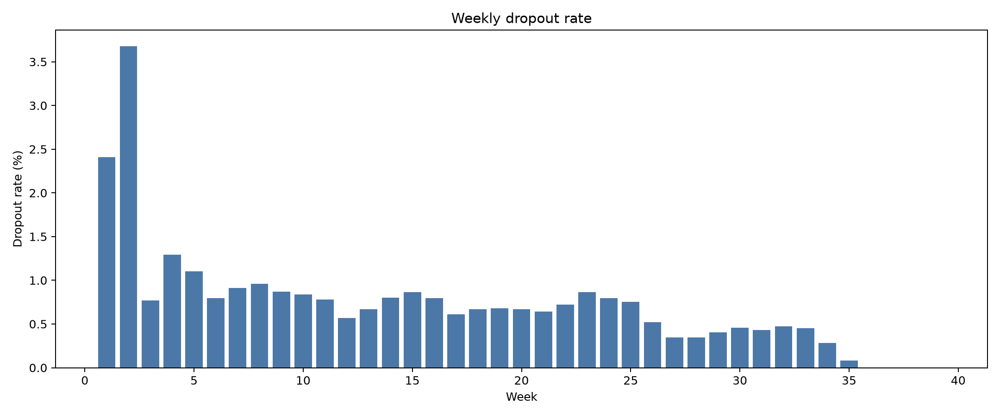
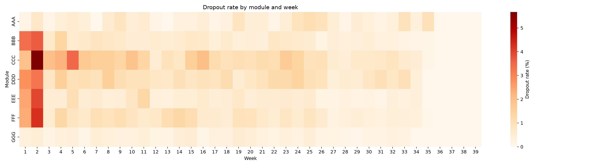
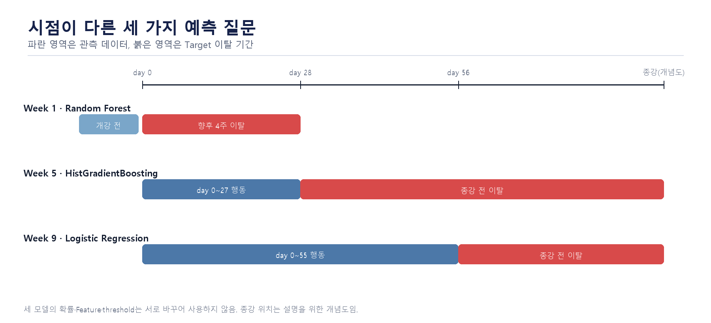
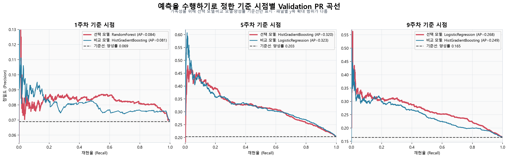

# OULAD 1~10주차 다음 주 중도이탈 조기경보

OULAD 학습 데이터를 이용해 **개강 후 1~10주 동안 매주 다음 주에 이탈할
위험이 높은 학생·과목을 예측**하고, 위험 행동과 과목 특성에 맞는 유지 활동을
제안하는 프로젝트입니다.

> 데이터 분석 → 주간 이탈 확률 예측 → 조기 위험자 선별 → 행동 기반 개입 제안

## 프로젝트 한눈에 보기

| 구분 | 내용 |
|---|---|
| 사용자 | 교육 서비스 운영자, 학습 상담 담당자 |
| 분석 단위 | `학생 + 과목 + 운영 회차 + 예측 주차` |
| 관측 시점 | 각 주차 종료 시점 |
| 예측 대상 | 현재 수강 중인 학생의 **다음 주 중도이탈 여부** |
| 운영 구간 | 개강 후 **1~10주차** |
| 최종 모델 | CatBoost, 124개 Feature |
| 위험 기준 | 예측확률 `0.1100300614` 이상 |
| 서비스 결과 | 이탈 확률, 위험 여부, 위험 행동, 유지 활동 제안 |


## 프로젝트 구조

```text
oulad-churn-prediction/
├── artifacts/                         # 저장소 공용 산출물 폴더
├── data/                              # OULAD 원본·중간·가공 데이터
│   ├── raw/                           # 원본 OULAD CSV 데이터
│   ├── interim/                       # 전처리 중간 결과
│   └── processed/                     # 모델 학습용 최종 데이터셋
│
├── docs/                              # 프로젝트 문서 및 설명 자료
│
├── models/                            # 모델 학습·평가·비교 코드
│   ├── artifacts/                     # 모델별 joblib·프로필 등 모델 산출물
│   ├── demo_1/                        # 기존 실험 및 비교 결과
│   ├── feature_importance/            # 변수 중요도 분석
│   ├── feature_set_comparison/        # 피처 구성별 성능 비교
│   │
│   ├── common_weekly_metrics.py       # 주차별 데이터 준비·공통 평가지표 기능
│   ├── early_weekly_common.py         # 1~10주차 Early 모델 공통 기능
│   ├── early_final_artifact_common.py # 최종 모델 저장·불러오기 공통 기능
│   ├── early_train_final_catboost_joblib.py
│   │                                  # ★ 실제 사용할 Early CatBoost 재학습 스크립트
│   │
│   ├── early_train_final_xgboost_joblib.py
│   ├── early_train_final_randomforest_joblib.py
│   ├── early_train_final_elasticnet_joblib.py
│   │                                  # Early CatBoost와 비교한 대체 모델
│   │
│   ├── 01_xgboost_weekly_next_week.py/.ipynb
│   ├── 02_catboost_weekly_next_week.py/.ipynb
│   ├── 03_dummy_weekly_next_week.py/.ipynb
│   ├── 04_elasticnet_logistic_weekly_next_week.py/.ipynb
│   ├── 05_randomforest_weekly_next_week.py/.ipynb
│   ├── 06_gru_weekly_next_week.py
│   ├── 07_compare_catboost_gru.py
│   ├── 08_catboost_feature_ablation.py
│   ├── 08_train_final_catboost_joblib.py
│   ├── 09_tcn_weekly_next_week.py
│   ├── 10_compare_all_models.py
│   └── 11_build_streamlit_profiles.py # 기존 실험·비교·프로필 생성 코드
│
├── notebooks/                         # 탐색적 분석(EDA) 및 시각화 노트북
├── reports/                           # 최종 분석 결과·모델 비교 보고서
├── src/                               # 재사용 가능한 전처리·평가·임계값 계산 코드
├── streamlit_app/                     # 예측 결과를 보여 주는 Streamlit 서비스 화면
├── tests/                             # 코드 동작 확인용 테스트
│
├── .env.example                       # 환경변수 예시
├── .gitignore                         # Git 추적 제외 규칙
├── README.md                          # 프로젝트 개요·실행 방법·평가지표
└── requirements.txt                   # 필요한 파이썬 라이브러리 목록
```

## 왜 1~10주차인가?

전체 수강 기간을 먼저 탐색한 결과, 이탈 위험은 초반에 크게 나타나며 특히
2주차 부근에서 가장 높은 수준을 보였습니다. 전체 주차 EDA는 운영 구간을
임의로 정한 것이 아니라 **조기 개입이 가능한 시점을 찾기 위한 근거**로
사용했습니다.



과목별로도 위험 수준과 변화 시점이 달라 동일한 학생 행동이라도 과목에 따라
개입 우선순위와 유지 활동을 다르게 제안합니다.



## 데이터와 Feature

### 데이터

- 학생·수강 정보: `studentInfo`, `studentRegistration`, `courses`
- 학습 행동: `studentVle`, `vle`
- 평가 정보: `assessments`, `studentAssessment`
- 분석 키: `id_student + code_module + code_presentation + prediction_week`

### 주요 Feature

- **학생·강좌:** 과목, 운영 회차, 성별, 연령대, 학력, 지역, 이전 수강 시도
- **VLE 행동:** 현재·누적 클릭, 활동일, 이용 콘텐츠, 활동 유형, 무활동 기간
- **활동 유형:** 포럼, 퀴즈, 학습자료, OU Content, 기타 클릭
- **평가:** 마감 평가, 제출·미제출, 지각 제출, 점수 통계
- **변화량:** 클릭 증감, 활성 주차 비율, 최근 활동, 활동 유형별 누적 비중

OULAD의 클릭 수는 실제 학습 시간이 아니라 LMS에 기록된 콘텐츠 접근·상호작용
횟수이므로 **학습 참여량의 대리 지표**로 해석합니다.

## 최종 Early 모델

CatBoost는 전체 주차의 주간 학습 행으로 학습하고 학생 단위 3-Fold OOF로
검증했습니다. 실제 서비스는 조기 개입이 가능한 1~10주차로 한정하고, 해당
구간의 OOF 결과에서 F1이 최대가 되는 임계값을 사용합니다.

> 즉, **전체 주차로 학습한 주간 CatBoost를 1~10주차 Early 서비스에 적용**한
> 구조입니다.

### 1~10주차 Early 성능

- 평가 행: 271,663건
- 다음 주 이탈: 3,316건(1.2206%)
- 운영 임계값: `0.1100300614`
- 확률 보정: 별도 보정 미적용

| 모델 | Precision | Recall | F1 | PR-AUC | ROC-AUC |
|---|---:|---:|---:|---:|---:|
| **CatBoost** | **27.86%** | 20.14% | **23.38%** | **0.158890** | **0.843639** |
| XGBoost weighted | 20.56% | 20.75% | 20.65% | 0.118739 | 0.837438 |
| Random Forest | 27.61% | 15.41% | 19.78% | 0.141936 | 0.828475 |
| ElasticNet | 7.20% | **28.44%** | 11.49% | 0.050780 | 0.804845 |

CatBoost는 Early 구간에서 Precision·F1·PR-AUC가 가장 높아 최종 서비스
모델로 선택했습니다. Recall은 ElasticNet이 더 높으므로 “모든 지표에서
CatBoost가 최고”라고 해석하지 않습니다.

## 추가 모델 실험

124개 Feature CatBoost를 최종 모델로 유지하면서 Feature 축소와 시계열
딥러닝 모델을 추가 실험했습니다. 아래 그림은 **전체 주차 OOF 기준**이므로
위의 1~10주차 Early 성능표와 평가 범위가 다릅니다.


| 딥러닝 모델 | 입력 | ROC-AUC | PR-AUC | Recall@Top20% |
|---|---|---:|---:|---:|
| GRU | 최근 4주, 11개 행동 Feature | 0.7255 | 0.0271 | 49.54% |
| TCN | 최근 4주, 11개 행동 Feature | 0.7259 | 0.0279 | 49.34% |


- [GRU ROC·PR Curve](reports/figures/deep_learning_roc/gru_roc_pr_curves.png)
- [TCN ROC·PR Curve](reports/figures/deep_learning_roc/tcn_roc_pr_curves.png)

GRU·TCN은 무작위 기준보다 높은 분류 신호를 학습했지만 CatBoost를 넘지
못했고 앙상블도 개선되지 않아, 최종 Streamlit 추론 경로에는 연결하지
않았습니다.

## Streamlit 서비스

| 화면 | 기능 |
|---|---|
| 대시보드 | 전체 이탈 현황과 핵심 지표 확인 |
| 과목별 행동 제안 | 과목·주차별 위험 신호와 운영 제안 |
| 학생별 행동 추천 | 학생 행동 유형에 따른 유지 활동 제안 |
| 이탈 예측 | 입력값 기반 다음 주 이탈 확률과 위험 여부 제공 |

```bash
python -m pip install -r requirements.txt
streamlit run streamlit_app/app.py
```

Streamlit은 `catboost.joblib`의 모델·124개 Feature 순서와
`early_service_config.json`의 1~10주차 운영 범위·임계값을 함께 사용합니다.
`early_catboost.joblib`은 동일 모델을 Early 운영 메타데이터와 함께 묶은 별도
산출물입니다.

## 프로젝트 구조

```text
├── data/
│   ├── raw/                    # OULAD 원본(배포 제외)
│   ├── interim/                # 정제·주차 집계 데이터
│   └── processed/              # 모델 입력 Snapshot
├── notebooks/                  # 전처리·EDA 노트북
├── src/                        # 데이터 생성·검증·평가 코드
├── models/                     # ML·DL 학습 코드와 모델 산출물
├── reports/                    # 분석 보고서와 시각화
├── streamlit_app/              # 조기경보 서비스
└── tests/                      # 데이터·모델·서비스 검증
```

## 주요 산출물

- 최종 CatBoost: `models/artifacts/catboost.joblib`
- Early 패키지: `models/artifacts/early_catboost.joblib`
- Early 운영 설정: `models/artifacts/early_service_config.json`
- 최종 모델 생성: `models/08_train_final_catboost_joblib.py`
- Early 모델 생성: `models/early_train_final_catboost_joblib.py`
- Early OOF 평가: `src/early_catboost_threshold_report.py`
- EDA 보고서: `reports/eda_report.md`
- 모델 비교 보고서: `reports/final_model_comparison_report.md`
- Streamlit 추론 연결: `streamlit_app/lib/model.py`

초기 기획에서 사용한 `model_snapshot_week_1·2·4.csv`는 시점별 전처리·EDA
검증 산출물이며, 현재 메인 모델은 매주 행을 가진 `weekly_next_week` 학습
테이블을 사용합니다.

## 검증

```bash
python -m unittest discover -s tests -v
```

### 재현·해석 시 주의사항

- `target_next_week_withdrawn`, `final_result`, `date_unregistration` 등 정답과
  미래 정보는 입력 Feature에서 제외합니다.
- 동일 학생의 모든 과목·주차 행은 하나의 Fold에만 포함해 학생 간 누수를
  방지합니다.
- Early 임계값은 1~10주차 OOF 부분집합에서 선택한 운영 기준입니다.
- Early 성능은 완전히 독립된 외부 테스트 성능으로 표현하지 않습니다.
- 이탈률이 매우 낮은 불균형 문제이므로 ROC-AUC만 보지 않고 PR-AUC,
  Precision, Recall을 함께 해석합니다.

## 비교: 예측 기준 시점별 추가 실험

> [!NOTE]
> 이 보조 실험은 기존 **1~10주차 다음 주 이탈 예측 CatBoost 서비스**를
> 대체하지 않는다. 운영 시점에 따라 관측할 수 있는 정보와 Target 기간이
> 어떻게 달라지는지 확인하기 위한 별도의 실험이다.

### 시점별 예측 질문

- **Week 1:** 개강일 현재 수강 중인 학생의 향후 4주 이탈
- **Week 5:** 5주차 시작 시점 현재 수강 중인 학생의 종강 전 이탈
- **Week 9:** 9주차 시작 시점 현재 수강 중인 학생의 종강 전 이탈



| 실험 | 예측 시점 | Target이 1인 기간 | 관측 데이터 | Feature 수 |
|---|---|---|---|---:|
| `week1_next4` | 개강일 (`day 0`) | `day 0~27` 이탈 | 개강 전 정적·수강 정보 | 8개 |
| `week5_course_end` | 5주차 시작 (`day 28`) | `day 28` 이후 종강 전 이탈 | `day 0~27` 행동 | 14개 |
| `week9_course_end` | 9주차 시작 (`day 56`) | `day 56` 이후 종강 전 이탈 | `day 0~55` 행동 | 14개 |

> [!IMPORTANT]
> 세 질문은 모집단과 Target 기간이 서로 다르다. 따라서 모델, threshold,
> 예측확률과 성능을 서로 바꾸어 사용하거나 절대 점수만으로 직접 순위를
> 매기지 않는다.

### Validation PR 곡선



가독성을 위해 각 시점의 선택 모델, 비교 모델과 양성률 기준선만 표시했다.
패널별 y축 확대 범위가 다르므로 곡선의 높이를 시점 간 절대 성능 차이로
직접 해석하지 않는다.
