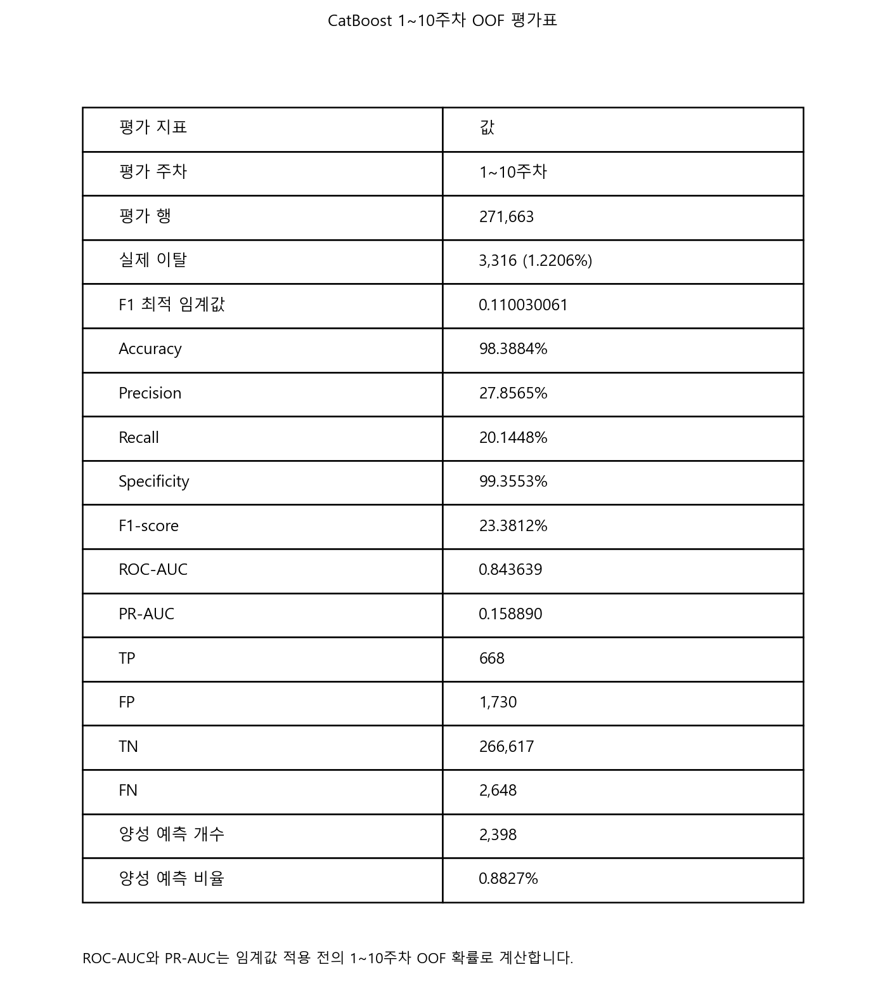

# OULAD 1~10주차 다음 주 중도이탈 조기예측 프로젝트

OULAD 학습 데이터로 **개강 후 1~10주 동안 매주 다음 주에 중도이탈할
위험이 높은 학생·과목**을 선별하고, 행동 신호와 과목 특성에 맞는 유지
활동을 제안합니다.

> 데이터 분석 → 다음 주 이탈 확률 예측 → 조기 위험자 선별 → 유지 활동 제안

## 핵심 서비스 정의

- 사용자: 교육 서비스 운영자·학습 상담 담당자
- 분석 단위: `id_student + code_module + code_presentation + prediction_week`
- 예측 시점: 개강 후 1~10주차 각 주 종료 시점
- Target: 현재 수강 중인 학생이 **다음 주에 이탈하면 1**, 아니면 0
- 최종 모델: CatBoost Enhanced, 124개 Feature
- 운영 임계값: 예측확률 `0.1100300614` 이상
- 확률 보정: Platt Scaling 등 별도 보정 미적용

CatBoost는 전체 주차 학습 행을 이용해 학습·OOF 검증했으며, 서비스는 조기
개입이 가능한 1~10주차로 한정합니다. 따라서 현재 Early 결과는
**1~10주차만으로 새로 학습한 모델**이 아니라, 전체 주차 OOF 예측에서
1~10주차 운영 구간을 평가한 결과입니다.

## 프로젝트 구조

oulad-churn-prediction/
├── artifacts/                         # 저장소 공용 산출물 폴더
├── data/                              # OULAD 원본·중간·가공 데이터
│   ├── raw/                           # 원본 OULAD CSV 데이터
│   ├── interim/                       # 전처리 중간 결과
│   └── processed/                     # 모델 학습용 최종 데이터셋
│
├── docs/                              # 프로젝트 문서 및 설명 자료
│
├── models/                            # 모델 학습·평가·비교 코드
│   ├── artifacts/                     # 모델별 joblib·프로필 등 모델 산출물
│   ├── demo_1/                        # 기존 실험 및 비교 결과
│   ├── feature_importance/            # 변수 중요도 분석
│   ├── feature_set_comparison/        # 피처 구성별 성능 비교
│   │
│   ├── common_weekly_metrics.py       # 주차별 데이터 준비·공통 평가지표 기능
│   ├── early_weekly_common.py         # 1~10주차 Early 모델 공통 기능
│   ├── early_final_artifact_common.py # 최종 모델 저장·불러오기 공통 기능
│   ├── early_train_final_catboost_joblib.py
│   │                                  # ★ 실제 사용할 Early CatBoost 재학습 스크립트
│   │
│   ├── early_train_final_xgboost_joblib.py
│   ├── early_train_final_randomforest_joblib.py
│   ├── early_train_final_elasticnet_joblib.py
│   │                                  # Early CatBoost와 비교한 대체 모델
│   │
│   ├── 01_xgboost_weekly_next_week.py/.ipynb
│   ├── 02_catboost_weekly_next_week.py/.ipynb
│   ├── 03_dummy_weekly_next_week.py/.ipynb
│   ├── 04_elasticnet_logistic_weekly_next_week.py/.ipynb
│   ├── 05_randomforest_weekly_next_week.py/.ipynb
│   ├── 06_gru_weekly_next_week.py
│   ├── 07_compare_catboost_gru.py
│   ├── 08_catboost_feature_ablation.py
│   ├── 08_train_final_catboost_joblib.py
│   ├── 09_tcn_weekly_next_week.py
│   ├── 10_compare_all_models.py
│   └── 11_build_streamlit_profiles.py # 기존 실험·비교·프로필 생성 코드
│
├── notebooks/                         # 탐색적 분석(EDA) 및 시각화 노트북
├── reports/                           # 최종 분석 결과·모델 비교 보고서
├── src/                               # 재사용 가능한 전처리·평가·임계값 계산 코드
├── streamlit_app/                     # 예측 결과를 보여 주는 Streamlit 서비스 화면
├── tests/                             # 코드 동작 확인용 테스트
│
├── .env.example                       # 환경변수 예시
├── .gitignore                         # Git 추적 제외 규칙
├── README.md                          # 프로젝트 개요·실행 방법·평가지표
└── requirements.txt                   # 필요한 파이썬 라이브러리 목록

## 1~10주차 Early 결과

- 평가 행: 271,663건
- 다음 주 이탈: 3,316건(1.2206%)
- 분할: `id_student` 기준 3-Fold OOF
- 임계값 선택: 1~10주차 OOF 부분집합에서 F1 최대

| 모델 | Precision | Recall | F1 | PR-AUC | ROC-AUC |
|---|---:|---:|---:|---:|---:|
| **CatBoost** | **27.86%** | 20.14% | **23.38%** | **0.158890** | **0.843639** |
| XGBoost weighted | 20.56% | 20.75% | 20.65% | 0.118739 | 0.837438 |
| Random Forest | 27.61% | 15.41% | 19.78% | 0.141936 | 0.828475 |
| ElasticNet | 7.20% | **28.44%** | 11.49% | 0.050780 | 0.804845 |

CatBoost는 Early 구간에서 Precision·F1·PR-AUC가 가장 높아 최종 서비스
모델으로 선택했습니다. Recall만 가장 높은 모델은 ElasticNet이므로,
"모든 지표에서 CatBoost가 최고"라고 해석하지 않습니다.



## 분석 구성

### 주차별 분석: 언제 개입할 것인가?

- 전체 수강 기간의 주차별 이탈 건수·이탈률
- 다음 주 이탈률과 주차별 VLE 활동 변화
- 1~10주차 Early 예측 성능과 조기 개입 가능성

전체 주차 EDA는 1~10주차를 서비스 구간으로 선정한 배경 근거로 사용합니다.

### 과목별 분석: 누구에게 어떤 개입을 제공할 것인가?

- 과목별 이탈률·이탈 시점
- 과목별 클릭량·무활동·평가 제출 차이
- 행동 신호와 과목 특성을 결합한 유지 활동

## 주요 Feature

- 학생·강좌: 과목, 운영 회차, 성별, 연령대, 학력, 지역, 이전 수강 시도
- VLE: 현재·누적 클릭, 활동일, 이용 콘텐츠, 활동 유형, 무활동 기간
- 활동 유형: 포럼, 퀴즈, 학습자료, OU Content, 기타 클릭
- 평가: 마감 평가, 제출·미제출, 지각 제출, 점수 통계
- 파생 Feature: 클릭 증감, 활성 주차 비율, 최근 활동, 활동 유형별 누적 비중

OULAD의 클릭 수는 정확한 학습 시간이 아니라 LMS에 기록된 접근·상호작용
횟수이므로 학습 참여량의 대리 지표로 해석합니다.

## 최종 모델과 추가 실험

- **CatBoost 124 Feature**: 최종 서비스 모델
- CatBoost 108 Feature: Feature 축소 가능성을 확인한 추가 실험
- GRU·TCN: 최근 4주 행동 순서를 사용한 딥러닝 비교 실험
- 언더·오버샘플링, 규제, 이중 경보: 후보 운영 정책 실험

GRU·TCN은 무작위 기준보다는 높은 신호를 학습했지만 CatBoost를 넘지
못했으며, 앙상블도 개선이 없어 실제 추론 경로에 연결하지 않습니다.

## 주요 산출물

- 최종 모델: `models/artifacts/catboost.joblib`
- Early 운영 설정: `models/artifacts/early_service_config.json`
- 모델 생성: `models/08_train_final_catboost_joblib.py`
- Early 평가: `src/early_catboost_threshold_report.py`
- Early 결과: `outputs/threshold_analysis/early_catboot/`
- 모델 비교 보고서: `reports/final_model_comparison_report.md`
- EDA 보고서: `reports/eda_report.md`
- Streamlit 추론 연결: `streamlit_app/lib/model.py`

`data/processed/model_snapshot_week_1.csv`, `week_2.csv`, `week_4.csv`는 초기 기획의
시점별 전처리·EDA 검증 산출물이다. 현재 메인 모델은 매주 행을 가진
`weekly_next_week` 학습 테이블을 사용한다.

## Streamlit 실행

```bash
python -m pip install -r requirements.txt
streamlit run streamlit_app/app.py
```

Streamlit은 1~10주차 학생의 다음 주 이탈확률과 Early 임계값을 사용해
위험자를 분류하고, 행동 신호와 유지 활동을 표시한다.

## 테스트

```bash
python -m unittest discover -s tests -v
```

## 재현 시 주의사항

- `target_next_week_withdrawn`, `final_result`, `date_unregistration` 등 정답·미래 정보는 Feature에서 제외한다.
- 동일 학생의 모든 과목·주차 행은 하나의 Fold에만 포함한다.
- 분류 임계값 `0.1100300614`는 1~10주차 OOF 부분집합에서 F1을 최대화한 운영 기준이다.
- Early 성능 상승의 일부는 전체 주차보다 양성 비율이 높은 1~10주차로 평가 범위를 한정한 효과이다.
- 현재 Early 임계값은 OOF 운영 분석 결과이며, 완전히 독립된 외부 테스트 성능으로 표현하지 않는다.
