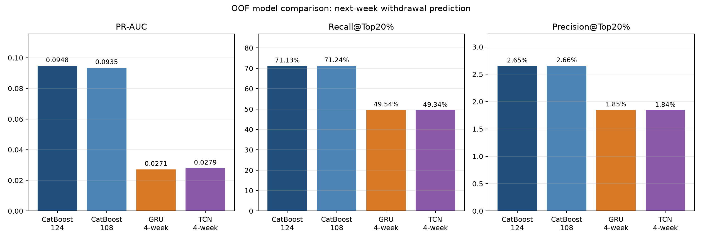

# CatBoost Enhanced Feature 감사 보고서

## 결론

전체 CSV는 126열이지만 `id_student`와 `target_next_week_withdrawn`을 제외한
실제 모델 입력은 124개다. 124개가 모두 독립적이고 유의미한 것은 아니며,
품질 점검 결과 16개를 우선 축소 후보로 선정했다.

다만 Enhanced 124개는 Base 51개보다 OOF 성능이 실제로 높았다.

| Feature Set | PR-AUC | Recall@Top20% | Precision@Top20% |
|---|---:|---:|---:|
| Base 51 | 0.089319 | 69.62% | 2.59% |
| Enhanced 124 | 0.094775 | 71.13% | 2.65% |

따라서 확장 Feature 전체를 무조건 폐기하지 않고, 명확한 품질 문제와 중복만
제거한 108개 후보를 동일한 학생 3-Fold OOF로 재학습해 124개 모델과 비교한다.

## 확인된 축소 후보

### 전체 행에서 상수인 4개

- `imd_band_missing`
- `assessment_banked_due_count`
- `assessment_submitted_exam_count`
- `any_known_banked_count`

상수 Feature는 어떤 학생도 구분하지 못하므로 제거해도 정보 손실이 없다.

### 생성 품질 이상 1개

- `vle_cum_unique_sites`

전체의 57.44%가 결측이고, 누적 클릭이 있는데도 이 값이 비어 있는 행이
484,708건이므로 현재 생성 결과를 신뢰하기 어렵다. 수정된 생성 로직으로
재생성하기 전에는 입력에서 제외하는 것이 안전하다.

### 전체 행 완전 중복 6개

- `assessment_nonbanked_submitted_count`
- `any_known_submission_count`
- `any_known_scored_count`
- `any_known_score_missing_count`
- `any_known_mean_score`
- `any_known_median_score`

각 컬럼은 유지하는 대응 Feature와 895,005행 전체에서 동일하다. 중복 컬럼을
여러 번 넣으면 모델 설명과 중요도 해석만 복잡해진다.

### 결정론적 중복 또는 트리 단조 변환 5개

- `cutoff_day`: `prediction_week * 7 - 1`
- `current_has_vle_record`: `current_no_activity`의 반대 값
- `log1p_cum_total_clicks`: 누적 클릭의 단조 변환
- `log1p_current_total_clicks`: 현재 클릭의 단조 변환
- `log1p_pre_course_clicks`: 개강 전 클릭의 단조 변환

로그 변환은 선형·신경망 모델에는 유용하지만 트리 모델에서는 원본과 분할
순서가 같아 정보가 중복된다.

## 108개 OOF 재학습 결과

동일한 학생 단위 3-Fold와 CatBoost 설정으로 축소 후보를 실제 검증했다.

| Feature Set | PR-AUC | Recall@Top20% | Precision@Top20% | Brier | ECE |
|---|---:|---:|---:|---:|---:|
| Enhanced 124 | 0.094775 | 71.13% | 2.651% | 0.007045 | 0.000242 |
| Reduced 108 | 0.093502 | 71.24% | 2.655% | 0.007050 | 0.000213 |

108개 모델은 PR-AUC가 0.001273 낮지만, 프로젝트 운영 지표인 Recall@Top20%는
0.10%p 높고 상위 위험군에서 실제 이탈자 7명을 더 포착했다. 두 모델의 예측순위
Spearman 상관은 0.9852이고 Top20% 대상자 중 92.76%가 겹쳐 실질적인 위험군
구성도 거의 동일하다.

## 최종 결정

축소 실험에서는 108개 모델의 Recall@Top20%가 0.10%p 높았지만 124개 모델의
PR-AUC가 더 높았고, 실제 위험군 구성도 대부분 겹쳤다. 기존 모델 학습·SHAP
분석·Streamlit 연동이 124개 Feature를 기준으로 완료된 점까지 고려해
**최종 서비스 모델은 Enhanced 124개 Feature를 유지한다.**

- Enhanced 124개: 최종 서비스 모델
- Reduced 108개: Feature 축소 가능성을 확인한 추가 실험
- 1~10주차 Early 서비스 위험 학생 분류: CatBoost 예측확률 `0.1100300614` 이상
- 별도의 Platt Scaling 또는 확률 보정: 적용하지 않음

축소 결과 파일은 다음과 같다.

- `models/demo_1/catboost_reduced_feature_metrics.csv`
- `models/demo_1/catboost_reduced_feature_fold_metrics.csv`
- `models/demo_1/catboost_reduced_feature_oof_predictions.csv` (대용량·Git 제외)

## 재현 방법

`models/08_catboost_feature_ablation.py --train-ablation`으로 108개 축소 실험을
동일한 학생 Fold에서 재현할 수 있다. 이 실험은 최종 124개 모델을 대체하는 것이
아니라 Feature 축소 시 성능 변화가 작다는 점을 확인한 추가 분석으로 관리한다.

최종 모델과 124개 Feature 순서는 `models/artifacts/catboost.joblib`에 함께
저장되어 있다. 모델 재생성 코드는 `models/08_train_final_catboost_joblib.py`다.
