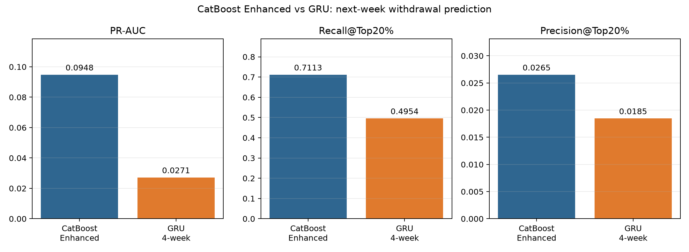
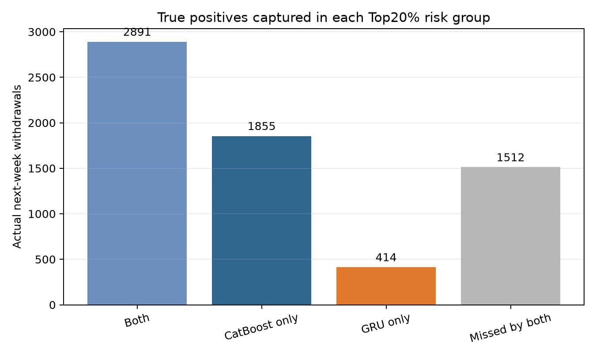

# Demo1 CatBoost–GRU 비교 보고서

## 1. 실험 목적

매주 현재까지 관찰된 학생·강좌 데이터를 이용해 **다음 주 중도이탈 여부**를
예측한다. 정형 Feature 전체를 사용하는 CatBoost와 최근 4주 행동 순서를
학습하는 GRU를 동일한 학생 단위 3-Fold OOF 기준으로 비교했다.

## 2. 공통 평가 조건

- 관측 단위: `학생 + 과목 + 운영회차 + 예측 주차`
- 전체 행: 895,005건
- 실제 다음 주 이탈: 6,672건(0.7455%)
- 분할: 동일 학생의 모든 행을 한 Fold에 배정
- CatBoost: Enhanced 124개 Feature
- GRU: 최근 최대 4주 × 동적 행동 11개 Feature
- 핵심 지표: PR-AUC, Recall@Top20%, Precision@Top20%
- 확률 품질: Brier Score, ECE

## 3. OOF 결과 비교

| 모델 | PR-AUC | Recall@Top20% | Precision@Top20% | Brier | ECE |
|---|---:|---:|---:|---:|---:|
| CatBoost Enhanced | 0.094775 | 71.13% | 2.65% | 0.007045 | 0.000242 |
| GRU 최근 4주 행동 | 0.027145 | 49.54% | 1.85% | 0.210724 | 0.421469 |

양성 비율을 그대로 예측하는 무작위 수준의 PR-AUC는 약 0.007455다. GRU는
무작위보다 약 3.6배 높은 PR-AUC를 보여 시계열 행동 신호를 학습했지만,
CatBoost의 순위 성능과 위험군 포착률에는 미치지 못했다.

## 4. 두 모델이 잡은 실제 이탈자

상위 위험군 20%에서 포착한 실제 다음 주 이탈자는 다음과 같다.

| 구분 | 실제 이탈자 수 |
|---|---:|
| 두 모델 모두 포착 | 2,891명 |
| CatBoost만 포착 | 1,855명 |
| GRU만 포착 | 414명 |
| 두 모델 모두 놓침 | 1,512명 |

예측확률 Pearson 상관은 0.3591, 예측순위 Spearman 상관은 0.5542다. GRU가
CatBoost와 완전히 같은 순위를 만들지는 않았지만, 순위 기반 가중 혼합 실험에서
어떤 혼합 비중도 CatBoost 단독 PR-AUC 0.094775를 넘지 못했다. 따라서 414명의
추가 포착 가능성만으로 두 확률을 바로 합치는 것은 적절하지 않다.

## 5. GRU 확률 해석 주의

GRU는 극심한 클래스 불균형을 완화하려고 가중 BCE를 사용했다. 이 때문에
양성 순위를 학습하는 데는 도움이 되었지만 출력 확률이 실제 이탈률보다 크게
부풀어 Brier Score와 ECE가 높게 나타났다. 확률 보정은 가능하지만 보정은
순위 자체를 개선하지 않으므로 낮은 PR-AUC를 해결하지는 않는다.

## 6. 최종 사용 결정

- 실제 서비스 모델: **CatBoost Enhanced 124개 Feature 모델 사용**
- GRU: 최근 4주 행동 순서를 학습한 딥러닝 비교 실험으로 유지
- CatBoost–GRU 단순 평균 또는 순위 혼합: 현재 결과에서는 사용하지 않음
- 위험 학생 기준: 1~10주차 Early OOF 부분집합에서 F1을 최대화한 CatBoost 예측확률 `0.1100300614` 이상
- Demo2 Platt Scaling: 최종안에서 적용하지 않음

이 딥러닝 비교는 전체 주차 OOF 기준이며, 실제 서비스는 동일한 CatBoost를
1~10주차에 한정해 사용한다. 발표에서는 “딥러닝이 항상 더 우수한 것이 아니라, 이 데이터처럼 희소하고
불균형한 정형 데이터에서는 CatBoost가 더 적합했다”고 설명한다.

## 7. 산출물

- 비교 코드: `models/07_compare_catboost_gru.py`
- 비교 지표: `models/demo_1/catboost_gru_comparison_metrics.csv`
- Top20% 포착 관계: `models/demo_1/catboost_gru_top20_overlap.csv`
- 혼합 진단: `models/demo_1/catboost_gru_rank_blend_diagnostic.csv`
- 그래프: `reports/figures/demo1_gru/`

## 8. TCN 추가 비교 결과

GRU와 구조가 다른 TCN형 1D-CNN도 동일한 최근 4주 × 11개 Feature와 학생
Fold로 학습했다. TCN은 PR-AUC 0.027917, Recall@Top20% 49.34%로 무작위
수준보다 높은 시계열 신호를 학습했지만 CatBoost에는 미치지 못했다. 따라서
GRU와 TCN 모두 딥러닝 비교 실험으로 유지하고 최종 서비스에는 CatBoost를
사용한다.
