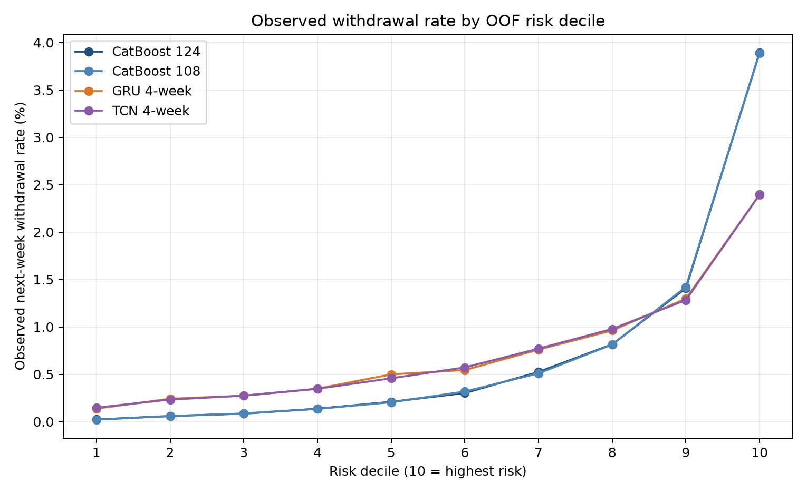

# 다음 주 이탈 예측 최종 모델 비교 보고서

## 1. 비교 목적

매주 현재까지 관찰된 학생·강좌 정보를 이용해 다음 주 중도이탈 위험자를
예측한다. 정형 Feature 기반 CatBoost 두 버전과 최근 4주 행동 Sequence를
사용한 GRU·TCN을 동일한 학생 단위 3-Fold OOF로 비교했다.

## 2. 데이터와 평가 기준

- 데이터: 895,005행, 학생 26,045명
- Target 양성: 6,672건(0.7455%)
- 동일 학생의 모든 주차 행은 동일 Fold에 배정
- 핵심 운영 지표: Recall@Top20%
- 전체 순위 품질: PR-AUC
- 확률 품질: Brier Score, ECE

## 3. 최종 OOF 성능

| 모델 | 입력 | PR-AUC | Recall@Top20% | Precision@Top20% | Brier | ECE |
|---|---|---:|---:|---:|---:|---:|
| CatBoost Enhanced | 124개 정형 Feature | 0.094775 | 71.13% | 2.651% | 0.007045 | 0.000242 |
| CatBoost Reduced | 108개 정형 Feature | 0.093502 | **71.24%** | **2.655%** | 0.007050 | **0.000213** |
| GRU | 최근 4주 × 11개 행동 | 0.027145 | 49.54% | 1.846% | 0.210724 | 0.421469 |
| TCN형 1D-CNN | 최근 4주 × 11개 행동 | 0.027917 | 49.34% | 1.839% | 0.207573 | 0.411354 |

무작위 수준의 PR-AUC는 Target 비율인 약 0.007455다. GRU와 TCN 모두 무작위
수준보다 약 3.6~3.7배 높은 값을 보여 최근 행동 Sequence의 이탈 신호를
학습했다. 그러나 정형·희소·극도 불균형 데이터에서는 CatBoost가 훨씬 우수했다.

## 4. GRU와 TCN 비교

- TCN의 PR-AUC가 GRU보다 0.000772 높다.
- GRU의 Recall@Top20%가 TCN보다 0.19%p 높다.
- 두 딥러닝 모델의 위험순위 Spearman 상관은 0.9529로 매우 높다.
- 즉, 구조는 다르지만 현재 4주 × 11개 행동 입력에서는 거의 같은 위험 패턴을
  학습했으며 둘을 함께 섞어 얻을 추가 정보가 크지 않다.

CatBoost 108의 Top20%에 없던 실제 이탈자를 GRU는 406건, TCN은 414건
포착했다. 하지만 이 포착을 위해 CatBoost와 순위를 혼합하면 전체 PR-AUC와
Recall@Top20%가 모두 하락했다. 따라서 단순 앙상블은 채택하지 않는다.

## 5. CatBoost Feature 실험과 최종 결정

124개 중 상수 4개, 생성 품질 이상 1개, 전체 행 완전 중복 6개, 결정론적 중복
5개를 제외한 108개 후보를 실제 OOF로 재학습했다.

108개 모델은 PR-AUC가 0.001273 낮지만 Recall@Top20%와 ECE가 소폭 개선됐고,
상위 20%에서 실제 이탈자 7명을 더 찾았다. 다만 차이가 매우 작고 기존 모델·SHAP
분석·Streamlit 연동이 124개 Feature를 기준으로 완료되어 있다. 또한 124개 모델의
전체 순위 품질인 PR-AUC가 더 높다. 따라서 **CatBoost Enhanced 124개를 최종
서비스 모델로 유지한다.** 108개 결과는 Feature 축소 가능성을 확인한 추가 실험으로
기록한다.

## 6. 최종 서비스 구성

1. 매주 124개 Feature로 CatBoost 다음 주 이탈확률을 계산한다.
2. 예측확률이 운영 임계값 `0.065` 이상인 학생을 위험 학생으로 분류한다.
3. Platt Scaling 등 별도의 확률 보정은 적용하지 않는다.
4. 위험 학생에게 SHAP 기반 주요 행동 근거와 유지 활동을 제공한다.
5. GRU와 TCN은 딥러닝 비교 실험 및 기술적 확장 결과로 제시한다.

GRU와 TCN은 가중 BCE로 학습해 원확률이 과대 추정됐다. 보정 전 딥러닝 확률은
Streamlit 위험 확률로 직접 사용하지 않는다.

## 7. 발표용 결론

> 최근 4주의 시계열 학습행동을 GRU와 TCN으로 학습했으며 두 모델 모두 무작위
> 기준보다 높은 예측력을 보였다. 그러나 OULAD처럼 희소하고 불균형한 정형
> 데이터에서는 CatBoost가 가장 높은 위험군 포착 성능을 보였다. 최종 서비스는
> 기존 후속 작업과의 일관성 및 더 높은 PR-AUC를 고려해 124개
> Feature CatBoost를 사용하고, 예측확률 0.065를 위험 학생 분류 기준으로 적용한다.
> 108개 축소 모델과 GRU·TCN은 추가 비교 실험으로 제시한다.

## 8. 산출물

- CatBoost–GRU 비교: `models/07_compare_catboost_gru.py`
- CatBoost Feature 감사·축소: `models/08_catboost_feature_ablation.py`
- TCN 학습: `models/09_tcn_weekly_next_week.py`
- 네 모델 최종 비교: `models/10_compare_all_models.py`
- 최종 지표: `models/demo_1/final_model_comparison_metrics.csv`
- 최종 그래프: `reports/figures/final_model_comparison/`
- 최종 모델: `models/artifacts/catboost.joblib`
- 최종 모델 생성: `models/08_train_final_catboost_joblib.py`
